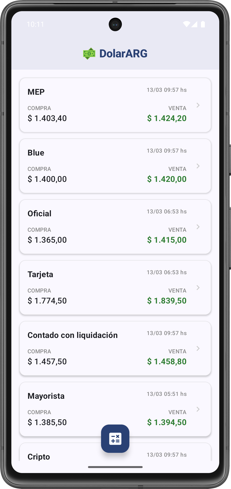

# 📱 DolarARG Monitor

Monitor de cotizaciones de dólares en Argentina. Una implementación funcional y robusta para practicar arquitectura y componentes modernos en Android.

---

## 🇦🇷 Castellano

### 📝 Descripción
DolarARG es una aplicación nativa diseñada para visualizar las distintas cotizaciones del dólar en tiempo real. El enfoque principal del proyecto es demostrar el dominio de herramientas modernas de Android y una arquitectura limpia.

### ✨ Características principales
* 🔄 **Pull-to-refresh**: Deslizar hacia abajo para actualizar los datos al instante.
* 🕒 **Hora Local**: Conversión de fechas UTC a la zona horaria de Argentina (GMT-3).
* 🎨 **Material 3**: Interfaz moderna con jerarquía visual y soporte para temas actuales.
* 🏗️ **Arquitectura**: Separación de capas mediante los patrones **MVVM** y **Repositorio**.

### 🏗️ Estructura del Proyecto
* **`data/`**: Gestión de red con Retrofit y lógica del Repositorio de datos.
* **`model/`**: Definición de entidades de datos y funciones de extensión para formateo.
* **`ui/`**: Pantallas con Jetpack Compose, ViewModels y gestión del estado de la interfaz.

---

## 🇺🇸 English

### 📝 Description
DolarARG is a native application designed to track real-time USD exchange rates in Argentina. The main goal of this project is to showcase proficiency in modern Android tools and clean architecture.

### ✨ Key Features
* 🔄 **Pull-to-refresh**: Swipe down to instantly refresh data.
* 🕒 **Local Timezone**: Automatic conversion from UTC dates to Argentina's local time (GMT-3).
* 🎨 **Material 3**: Modern UI with visual hierarchy and Material Design 3 support.
* 🏗️ **Architecture**: Clear layer separation using **MVVM** and **Repository** patterns.

### 🏗️ Project Structure
* **`data/`**: Network configuration (Retrofit) and Data Repository implementation.
* **`model/`**: Domain entities and extension functions for data formatting.
* **`ui/`**: Compose screens, ViewModels, and UI state management logic.

---

## 🛠️ Stack Tecnológico / Tech Stack
* **Kotlin** + **Coroutines**
* **Jetpack Compose** (UI)
* **Retrofit** (Networking)
* **ViewModel** & **State Management**

---
## 📸 Screenshots

