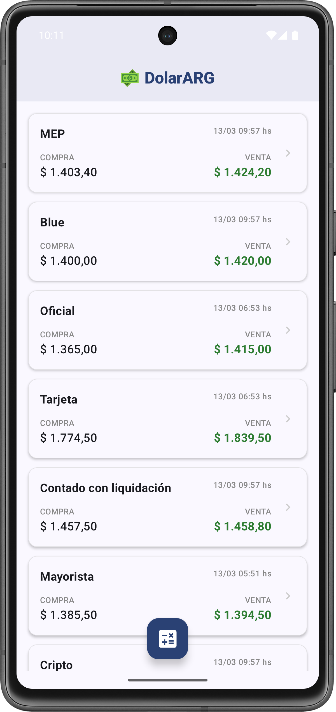
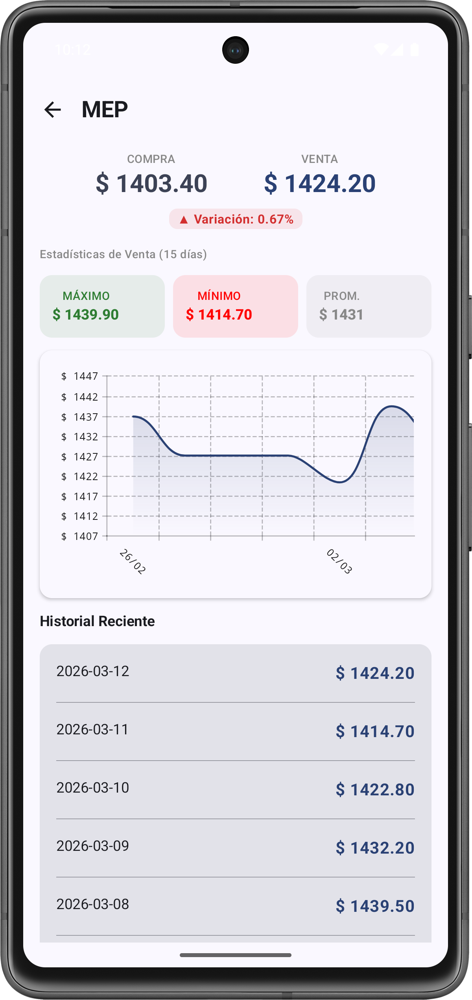

# 📱 DolarARG Monitor

Monitor de cotizaciones de dólares en Argentina. Una implementación funcional y robusta para practicar arquitectura y componentes modernos en Android.

---

## 🇦🇷 Castellano

### 📝 Descripción

DolarARG es una aplicación nativa diseñada para visualizar las distintas cotizaciones del dólar en
tiempo real y analizar su evolución histórica. El enfoque principal del proyecto es demostrar el
dominio de herramientas modernas de Android, visualización de datos complejos y una arquitectura
limpia.

### ✨ Características principales

* 📈 **Gráficos Históricos**: Visualización de la tendencia de los últimos 15 días con escala
  dinámica (Zoom) para apreciar variaciones mínimas.
* 🧮 **Calculadora Integrada**: Herramienta comparativa para convertir pesos a dólares (y viceversa)
  usando todas las cotizaciones disponibles.
* 📊 **Métricas de Análisis**: Cálculo automático de valores Máximos, Mínimos y Promedios quincenales
  sobre el precio de venta.
* 🔄 **Pull-to-refresh**: Deslizar hacia abajo para actualizar los datos al instante.
* 🕒 **Hora Local**: Conversión de fechas UTC a la zona horaria de Argentina (GMT-3).
* 🏗️ **Arquitectura**: Separación de capas mediante los patrones **MVVM**, **Repositorio** y uso de
  componentes modulares reutilizables.

### 🏗️ Estructura del Proyecto

* **`data/`**: Gestión de red con Retrofit, consumo de múltiples fuentes de datos (DolarAPI y
  ArgentinaDatos) y lógica del Repositorio.
* **`model/`**: Definición de entidades de datos, modelos históricos y funciones de extensión para
  formateo financiero.
* **`ui/`**: Pantallas con Jetpack Compose, navegación declarativa, ViewModels y gestión de estados
  complejos de la interfaz.

---

## 🇺🇸 English

### 📝 Description

DolarARG is a native application designed to track real-time USD exchange rates in Argentina and
analyze their historical evolution. The main goal of this project is to showcase proficiency in
modern Android tools, complex data visualization, and clean architecture.

### ✨ Key Features

* 📈 **Historical Charts**: 15-day trend visualization with dynamic scaling (Zoom) to highlight
  subtle price variations.
* 🧮 **Integrated Calculator**: Comparative tool to convert ARS to USD (and vice-versa) across all
  available rates.
* 📊 **Metrics Analysis**: Automatic calculation of bi-weekly Maximum, Minimum, and Average selling
  prices.
* 🔄 **Pull-to-refresh**: Swipe down to instantly refresh data.
* 🕒 **Local Timezone**: Automatic conversion from UTC dates to Argentina's local time (GMT-3).
* 🏗️ **Architecture**: Clear layer separation using **MVVM**, **Repository**, and modular reusable
  UI components.

### 🏗️ Project Structure

* **`data/`**: Network configuration (Retrofit), multi-source API consumption, and Repository
  implementation.
* **`model/`**: Domain entities, historical models, and extension functions for financial data
  formatting.
* **`ui/`**: Compose screens, declarative navigation, ViewModels, and complex UI state management
  logic.

---

## 🛠️ Stack Tecnológico / Tech Stack
* **Kotlin** + **Coroutines**
* **Jetpack Compose** (UI)
* **Vico Charts** (Data Visualization)
* **Retrofit** (Networking)
* **Navigation Compose** (Screen flow)
* **ViewModel** & **State Management**

---

## 📸 Screenshots

|          Home Screen           |            Detail Screen            |
|:------------------------------:|:-----------------------------------:|
|  |  |